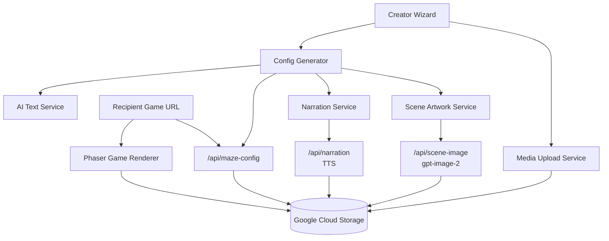

# MemoryMaze

MemoryMaze turns shared couple memories into a romantic AI-generated puzzle game that can be shared as a private web link or QR code.

Live demo domain: [traeconfessionmljh.vercel.app](https://traeconfessionmljh.vercel.app)

## Why It Matters

Most people want to give a memorable romantic gift, but very few can design a game, write a story, create illustrated scenes, generate narration, host media, and deploy a polished web experience. MemoryMaze compresses that whole creative workflow into a guided AI product.

A creator uploads real memories, photos, music, an optional voice sample, optional couple portraits, and a final confession. The system transforms those inputs into a playable web game with soft manga-style artwork, personalized puzzles, spoken hints, and a final confession moment.

For the recipient, the experience feels less like opening a generic card and more like walking through a private interactive love story.

## Hackathon Judging Highlights

- End-to-end AI product, not just a prompt demo.
- Multimodal generation across text, image, audio, and game configuration.
- Cloud-backed generated artifacts with shareable game links and QR codes.
- Config-driven Phaser renderer that can play many generated games from the same engine.
- Practical monetization path for anniversaries, birthdays, Valentine's Day, proposals, and long-distance couples.
- Strong viral loop because recipients can share screenshots, QR codes, and the uniqueness of the gift.

## Product Experience

### Creator Flow

1. **Enter relationship details**
   - Creator enters names, birthday, anniversary, important dates, and other puzzle reference data.
   - These values become clues, password answers, and emotional context for AI generation.

2. **Upload memories**
   - Each memory can include a title, date, location, people, dialogue, emotional description, and photos.
   - Photos are uploaded to Google Cloud Storage and passed as public links into the generation pipeline.

3. **Add optional personalization**
   - Upload one global music file used across the generated scenes.
   - Upload optional boy and girl portrait photos so generated artwork can better preserve face, figure, clothing color, and couple composition.
   - Upload an optional voice recording so the product can create a reusable voice profile for demo narration.

4. **Choose puzzle behavior**
   - The system supports memory quizzes, password locks, hidden-object scenes, and a simple 2 x 2 jigsaw challenge.
   - Jigsaw scenes use one square illustrated memory image split into four draggable pieces.

5. **Generate the game**
   - OpenAI generates scene text, hints, emotional copy, interactives, and puzzle logic.
   - OpenAI Image generation creates romantic manga-style scene artwork.
   - OpenAI text-to-speech creates spoken hints and the final confession letter.
   - The final config is uploaded to Google Cloud Storage under a unique maze ID.

6. **Preview and share**
   - The creator sees generated scene thumbnails, narration status, the embedded game preview, share link, and QR code.
   - Individual scene artwork can be regenerated without rebuilding the whole maze.

7. **Edit later**
   - Opening an existing generated puzzle by ID can load the stored config back into the creation flow.
   - The creator can edit fields and save over the same cloud config without calling the LLM again.

### Recipient Game Flow

1. The recipient opens a link such as:

   ```text
   https://traeconfessionmljh.vercel.app/game.html?id=<mazeId>
   ```

2. The game loads the stored config from Google Cloud Storage.

3. The recipient explores each memory scene:
   - Taps glowing interactive points to reveal different memory fragments.
   - Solves short relationship-based puzzles.
   - Drags jigsaw pieces into place for visual memory reconstruction scenes.
   - Hears gentle spoken hints and emotional long-form text.

4. After all fragments are collected, the final confession scene unlocks:
   - The final love letter is spoken aloud.
   - The uploaded confession video can play as the emotional ending.
   - The game becomes a keepsake link the couple can revisit.

## Current Feature Set

- Guided multi-step creation wizard.
- English default language with Chinese language switch support.
- Romantic manga diary visual direction as the default creation style.
- Google Cloud Storage uploads for images, music, videos, generated artwork, narration, and maze configs.
- Unique maze ID for each generated game.
- Direct game loading by URL query parameter.
- QR code generation for the final share link.
- Edit mode for previously generated maze configs.
- Per-scene generated artwork preview and regeneration.
- Global background music file used across all generated scenes.
- Optional couple portrait references for personalized image generation.
- Optional creator voice recording for narration demo flow.
- Phaser-based responsive web game.
- Mobile-friendly landscape layout, including compact jigsaw behavior for short mobile screens.
- Puzzle types:
  - Interactive memory hotspot
  - Password lock
  - Memory quiz
  - Hidden object
  - 2 x 2 jigsaw puzzle

## AI Pipeline

MemoryMaze uses AI as a production pipeline, not as a single isolated chat step.

### 1. Text And Game Logic Generation

The creation wizard sends structured memory data into the text-generation layer. The model returns:

- Scene titles and descriptions.
- Romantic memory fragments.
- Puzzle hints.
- Interactive hotspot objects.
- Per-scene challenge configuration.
- Final confession letter content.
- Game-ready JSON that can be consumed by Phaser.

The project currently keeps a demo-oriented client-side AI service for the wizard text generation:

```env
VITE_OPENAI_API_KEY=your_openai_api_key
VITE_OPENAI_MODEL=gpt-5.5
```

For production, this can be moved behind a serverless API to avoid exposing browser-visible API keys.

### 2. Romantic Manga Scene Artwork

Each memory scenario receives one AI-generated scene background. The visual style is intentionally light, warm, and romantic instead of dark or suspenseful.

Default direction:

- Gentle manga-inspired diary illustration.
- Soft pastel colors.
- Warm ivory, blush pink, peach, coral, pale sky blue, and soft mint accents.
- Intimate slice-of-life composition.
- No overlaid text, logos, watermarks, or fake UI icons inside the generated image.

Artwork generation uses server-only credentials:

```env
OPENAI_API_KEY=your_openai_api_key
OPENAI_IMAGE_MODEL=gpt-image-2
OPENAI_IMAGE_QUALITY=high
OPENAI_IMAGE_SIZE=2048x1152
OPENAI_IMAGE_JIGSAW_SIZE=2048x2048
OPENAI_IMAGE_OUTPUT_FORMAT=webp
OPENAI_IMAGE_OUTPUT_COMPRESSION=92
```

Normal memory scenes use `2048x1152` for high-quality 16:9 backgrounds. Jigsaw scenes use `2048x2048` so the four puzzle pieces are clean, even, and sharp.

### 3. Voice Narration

The narration system can generate spoken hints and final confession audio:

```env
OPENAI_TTS_MODEL=gpt-4o-mini-tts
OPENAI_TTS_VOICE=cedar
```

The current implementation is designed for a hackathon demo. It can accept an optional creator voice recording and create a voice profile that guides the tone of generated narration. The generated MP3 files are uploaded to cloud storage and referenced by the game config.

Important note: browser autoplay restrictions require audio playback to be started or resumed after a user gesture. The game therefore needs a tap/click entry moment before narration and music can reliably play.

### 4. Cloud Storage And Shareable Config

All large media artifacts are stored in Google Cloud Storage instead of browser local storage. This avoids quota errors such as:

```text
Failed to execute 'setItem' on 'Storage': Setting the value exceeded the quota.
```

Generated configs are stored under a stable maze ID:

```text
memorymaze/configs/<mazeId>.json
```

The recipient game loads the config through:

```text
/game.html?id=<mazeId>
```

## Technical Architecture



### Frontend

- Vite
- Vanilla JavaScript modules
- CSS
- QR generation for share links
- Wizard UI for creation and edit flows

### Game Engine

- Phaser.js
- Config-driven scene loading
- Responsive fullscreen canvas
- Mobile landscape optimization
- Interactive hotspots
- Drag-and-drop jigsaw puzzle
- Music, narration, video, and final scene playback

### Serverless APIs

The project uses Vercel serverless functions for sensitive and cloud-facing operations:

- `api/gcs-upload-url.js`
  - Creates signed upload URLs for media and generated files.

- `api/maze-config.js`
  - Saves and loads maze configs by ID.
  - Enables direct game URLs and edit mode.

- `api/scene-image.js`
  - Calls OpenAI Image generation with server-only credentials.
  - Supports reference-photo generation and text-only generation.

- `api/narration.js`
  - Generates spoken hint and confession audio.

- `api/voice-profile.js`
  - Handles optional voice-profile creation for demo narration personalization.

### Storage

- Google Cloud Storage for creator uploads, generated artwork, narration audio, videos, and configs.
- Signed upload flow for browser uploads.
- Public or CDN-readable URLs for game playback.

### Core Source Areas

```text
api/
  gcs-upload-url.js
  maze-config.js
  narration.js
  scene-image.js
  voice-profile.js

src/
  ai/
    AIService.js
    ConfigGenerator.js
    MediaUploader.js
    NarrationService.js
    SceneArtworkService.js
  game/
    GameBoot.js
    scenes/
      LevelScene.js
      FinalScene.js
  wizard/
  i18n/
  styles/

docs/
  GCS_MEDIA_SETUP.md
  RECIPIENT_GAME_DISPLAY_FLOW.md
```

## Jigsaw Puzzle Support

MemoryMaze supports a simple 2 x 2 jigsaw challenge for one image. This keeps the puzzle emotional and approachable instead of turning the gift into a frustrating game.

Example generated config shape:

```json
{
  "challenge": {
    "type": "jigsaw",
    "rows": 2,
    "cols": 2,
    "pieces": 4,
    "source": "background",
    "prompt": "Put this memory back together"
  },
  "interactives": []
}
```

When a scene is a jigsaw scene:

- The generated image is square.
- The game does not show extra hotspot icons.
- The image is split into four draggable pieces.
- Pieces appear in one row in the selection area when space allows.
- The scene is completed when all pieces are placed correctly.

## Business Value

### Customer Pain

Romantic gift-giving has a recurring emotional problem: people want to give something personal, but most available gifts are generic. Flowers, jewelry, handwritten cards, and photo albums can be meaningful, but they are familiar. A personalized interactive memory game feels rare, high-effort, and emotionally specific.

MemoryMaze targets moments where buyers have both urgency and willingness to pay:

- Anniversaries
- Valentine's Day
- Birthdays
- Proposals
- Apology gifts
- Long-distance relationship milestones
- Wedding or engagement surprises

### Why AI Makes This Possible

Without AI, creating this gift would require a writer, illustrator, game designer, voice actor, developer, and hosting setup. AI turns those specialized tasks into an automated generation pipeline:

- Text model writes emotional copy and game logic.
- Image model creates custom romantic scenes.
- TTS model speaks long text in a warm voice.
- Cloud storage and config IDs make the final artifact shareable.
- Phaser renders the generated game from JSON.

This creates a product with high perceived emotional value and relatively low marginal delivery cost.

### Suggested Pricing Model

A pay-per-generation model is more natural than a subscription because romantic gift creation is low-frequency but high-intent.

| Tier | Price | Value |
| --- | ---: | --- |
| Free Preview | $0 | One short scene, watermark, limited retention |
| Standard Confession | $9.90 | 3-5 scenes, no watermark, generated art, narration, share link |
| Premium Keepsake | $29.90 | More scenes, higher image quality, custom domain or downloadable package, longer retention |

### Viral Loop

The recipient is likely to share the experience because it is visually personal and emotionally surprising:

- Screenshots of illustrated memories.
- QR code sharing.
- Short clips of the final confession moment.
- Social posts about receiving a custom AI game.

This creates organic acquisition from the emotional reaction of the recipient, not only from paid ads.

## Potential Market Impact

MemoryMaze demonstrates how AI can move beyond productivity tools into emotional creative infrastructure. It makes interactive storytelling accessible to non-technical users and turns personal memories into playable media.

Potential expansion paths:

- Wedding planner and proposal agency partnerships.
- Photo studio add-on packages.
- Anniversary gift marketplace integrations.
- Long-distance couple app integrations.
- Offline keepsake exports.
- Custom domain gift pages.
- Multi-language romantic story generation.
- Voice-first memory albums.
- B2B white-label romantic event products.

The broader market impact is that personal digital gifts can become interactive, generated, and emotionally rich without requiring users to understand game development.

## Getting Started

Install dependencies:

```bash
npm install
```

Run the frontend-only Vite server:

```bash
npm run dev
```

The Vite-only server is useful for UI work, but it does not run the Vercel serverless APIs.

For the full local flow with `/api/*` routes, run:

```bash
npx vercel dev --listen 5173
```

Then open:

```text
http://localhost:5173/
```

Build the project:

```bash
npm run build
```

## Environment Variables

Use placeholders only in local docs and commits. Never commit real API keys, private keys, bucket names, or service account credentials.

```env
VITE_OPENAI_API_KEY=your_openai_api_key
VITE_OPENAI_MODEL=gpt-5.5

OPENAI_API_KEY=your_openai_api_key
OPENAI_IMAGE_MODEL=gpt-image-2
OPENAI_IMAGE_QUALITY=high
OPENAI_IMAGE_SIZE=2048x1152
OPENAI_IMAGE_JIGSAW_SIZE=2048x2048
OPENAI_IMAGE_OUTPUT_FORMAT=webp
OPENAI_IMAGE_OUTPUT_COMPRESSION=92
OPENAI_TTS_MODEL=gpt-4o-mini-tts
OPENAI_TTS_VOICE=cedar

GCS_BUCKET=your-bucket-name
GCS_CLIENT_EMAIL=your-service-account-email@your-project.iam.gserviceaccount.com
GCS_PRIVATE_KEY=your_service_account_private_key_with_escaped_newlines
GCS_PUBLIC_BASE_URL=
GCS_CONFIG_PREFIX=memorymaze/configs
```

Security notes:

- `OPENAI_API_KEY` is server-only and must not be prefixed with `VITE_`.
- `VITE_OPENAI_API_KEY` is visible to the browser in the current demo-oriented flow.
- ChatGPT Plus does not include OpenAI API credits.
- OpenAI Image API access may require organization verification.
- GCS media and config URLs must be readable by the deployed game.

## Deployment

1. Deploy the project to Vercel.
2. Add the environment variables in the Vercel project settings.
3. Configure the Google Cloud Storage bucket and service account.
4. Ensure uploaded media and config objects are readable by the web game.
5. Share generated games with:

   ```text
   https://traeconfessionmljh.vercel.app/game.html?id=<mazeId>
   ```

## Demo Narrative

Bob wants to surprise Alice for their anniversary. He enters their anniversary date, Alice's birthday, and three memories: the library where they first met, the amusement park where they spent a rainy afternoon, and the restaurant where he realized he wanted to propose.

MemoryMaze generates a soft manga-style scene for each memory, creates puzzle clues from their shared dates and details, adds narration for the long romantic text, and produces a private game link. Bob gives Alice a QR code at dinner. Alice scans it, solves each memory scene, reconstructs a jigsaw image from one special photo, and unlocks the final confession video.

The result is a custom interactive gift that feels handcrafted, even though the heavy creative work was generated by AI.

## Roadmap

- Move all text generation behind server-only APIs.
- Add richer puzzle templates such as photo wipe, constellation matching, and timeline ordering.
- Improve voice-personalization quality with production-grade consent and safety controls.
- Add downloadable offline keepsake packages.
- Add creator analytics such as recipient opened, scene completed, and final confession viewed.
- Add custom domain support for premium gifts.
- Add B2B templates for wedding planners and proposal agencies.

