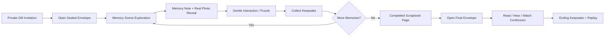

# MemoryMaze Recipient Game Display Flow

## Purpose

This document describes the proposed recipient-side game display experience based on the generated mobile mock boards. It focuses only on how an already generated puzzle is presented and played by the recipient. It does not define changes to the creator wizard, AI prompt pipeline, image/audio generation, storage, deployment, or payment flow.

The guiding principle is:

> She should feel invited into a carefully prepared memory album, not examined by a puzzle game.

## Mock Scenario

The flow below uses simulated content for a fictional couple.

| Item | Simulated Value |
| --- | --- |
| Creator | 陈屿 |
| Recipient | 林夏 |
| Occasion | 两周年纪念礼物 |
| Gift title | 写给林夏的记忆手帐 |
| Anniversary | 2026.05.20 |
| Memory 1 | 下雨的图书馆 |
| Memory 2 | 末班地铁前 |
| Memory 3 | 河边散步的傍晚 |
| Finale | 留给林夏的一封信 |

## Experience Goals

- Make the first impression private, personal, and ceremonial.
- Use the generated romantic manga scene artwork as the emotional center of each memory.
- Turn clickable exploration into gentle discovery rather than visual clutter.
- Make puzzles forgiving and affectionate, with no feeling of being tested.
- Reveal real memories and keepsakes as emotional rewards.
- Let the recipient control when to read, listen to, or watch the final confession.
- End with a lasting keepsake feeling, not simply a completion screen.

## Flow Overview



## Display Flow

### Screen 1: Private Gift Invitation

**Mock intent:** The recipient does not enter a generic game menu. She receives a personal digital gift.

**Primary display**

- Warm ivory paper background with soft blush accents.
- A share/invitation card addressed directly to the recipient.
- Minimal romantic illustration detail such as a small pressed flower or sealed ribbon.

**Simulated copy**

```text
写给林夏的记忆手帐

林夏，今晚想请你打开一份只属于我们的礼物。

来自：陈屿
2026.05.20 · 两周年
```

**Primary action**

```text
打开记忆礼物
```

**Recipient feeling**

The gift immediately feels personal and private, rather than like a public game link.

### Screen 2: Sealed Envelope Opening

**Mock intent:** Create a small ceremonial pause before gameplay begins.

**Primary display**

- An illustrated sealed envelope centered on screen.
- Recipient name written on the envelope.
- Soft opening animation after tapping: seal fades, envelope unfolds, first memory page appears.

**Simulated copy**

```text
To 林夏

有三段时光，
我一直想陪你重新走一遍。

仅你可见的私人礼物
```

**Primary action**

```text
轻轻打开
```

**Recipient feeling**

She chooses to open something prepared for her, establishing tenderness and anticipation.

### Screen 3: Illustrated Memory Exploration

**Mock intent:** Present each scene like an interactive manga diary page.

**Example scene**

```text
第一幕 · 下雨的图书馆
2024.09.12
```

**Primary display**

- Generated romantic manga background fills the playable stage.
- Scene title and date appear briefly as an elegant opening caption.
- A restrained HUD shows story progress rather than game scoring.
- Clickable objects are embedded naturally in the scene.

**Suggested HUD language**

| Current Concept | Proposed Display Language |
| --- | --- |
| Chapter / Level | 回忆页 |
| Memory shards | 收藏的小纪念 |
| Puzzle complete | 这一页已珍藏 |

**Mock HUD**

```text
回忆页 1 / 3                          收藏的小纪念 0 / 3
```

**Interactive treatment**

- A meaningful scene object, such as a red-covered book, receives a faint breathing glow.
- Glow should be subtle and environmental, not a large emoji icon or floating marker.
- A small temporary hint may appear:

```text
轻触发光的物件
```

**Recipient feeling**

She explores a beautiful shared moment, rather than hunting for game UI buttons.

### Screen 4: Memory Note And Real Photo Reveal

**Mock intent:** Reward discovery with an intimate statement and a connection to the real memory.

**Triggered by**

Tapping an interactive scene object.

**Primary display**

- A scrapbook-paper note overlays the illustrated background.
- The note includes a short emotional memory message.
- Where original photos exist, show a small photo tab or polaroid treatment labelled `真实照片`.
- The discovered object becomes a keepsake.

**Simulated copy**

```text
真实照片

那天你把伞往我这边倾了很多，
自己的肩膀却湿了。
我从那时开始，
觉得你是很温柔的人。

- 陈屿
```

**Actions**

```text
听他说这一刻
收进手帐
```

**Collected keepsake**

```text
获得：红皮书签
```

**Recipient feeling**

The illustrated fantasy returns gently to a real, noticed detail about her. This is one of the strongest emotional moments in the flow.

### Screen 5: Gentle Memory Interaction

**Mock intent:** Keep puzzle mechanics, but remove fear of failing a relationship test.

**Example scene**

```text
第二幕 · 末班地铁前
```

**Interaction example**

```text
你记得我总为你准备什么吗？

[ 热可可 ]   [ 柠檬茶 ]   [ 汽水 ]
```

**Supportive behavior**

- Answers are framed as playful recognition rather than a pass/fail gate.
- Incorrect selection does not shake the screen or show harsh failure colors.
- After uncertainty or an incorrect answer, the scene offers a reassuring hint.

**Simulated supportive copy**

```text
答错也没关系，我替我们记得。
```

**Optional voice action**

```text
听一小句提示
```

**Success reward**

```text
获得：热可可杯套
```

**Recipient feeling**

She is invited to remember affectionately, without pressure to prove anything.

### Screen 6: Completed Scrapbook Transition

**Mock intent:** Build anticipation before the final confession instead of jumping directly to it.

**Triggered by**

All memory scenes have been explored.

**Primary display**

- A completed scrapbook page displays collected keepsakes.
- A soft drawn line connects the keepsakes into a subtle heart or timeline.
- A sealed final envelope rests at the bottom of the page.

**Simulated content**

```text
我们的三段时光

红皮书签       雨天车票       热可可杯套

终章 · 留给林夏的一封信
```

**Primary action**

```text
打开最后一页
```

**Recipient feeling**

The prior memories become a thoughtful collection, and the finale feels earned without being mechanically gated.

### Screen 7: Final Confession Letter

**Mock intent:** Give the recipient control over the most emotional moment.

**Primary display**

- Warm illustrated final setting, such as a quiet riverside evening.
- A paper letter overlay addressed to the recipient.
- Readable letter body with scrolling for longer content.
- Distinct actions for voice narration and video rather than autoplay.

**Simulated copy**

```text
致 林夏

两年里，你让普通的日子变得值得珍藏。
未来还有很多空白页，
我想继续和你一起写。

永远喜欢你的，
陈屿
```

**Actions**

```text
听他的告白
播放视频
慢慢读完这封信
```

**Audio interaction note**

```text
轻触播放他的温柔声音
```

**Recipient feeling**

She can pause, read, listen, or watch in her own time. The finale becomes intimate instead of automatic or overwhelming.

### Screen 8: Keepsake Ending

**Mock intent:** Finish on a hopeful, saveable memory rather than a completed-game message.

**Primary display**

- Completed scrapbook cover or commemorative card.
- Tiny visual reminders of the visited scenes.
- A pressed flower, photo strip, or illustrated keepsake collection.

**Simulated copy**

```text
我们的故事，还在继续

2024.05.20 - 2026.05.20
两周年纪念

只保存在你们的私人链接中
```

**Actions**

```text
保存纪念卡
重看我们的回忆
给陈屿回一颗心
```

**Recipient feeling**

The gift leaves her with something to revisit and an emotional way to respond.

## Visual Direction

### Overall Mood

- Romantic manga diary.
- Light, emotionally safe, quietly nostalgic.
- Editorial scrapbook details rather than game-dashboard styling.

### Palette

| Purpose | Color Direction |
| --- | --- |
| Canvas/background | Warm ivory and paper white |
| Primary accent | Soft coral rose |
| Secondary accent | Peach and pressed-flower gold |
| Cool balance | Pale sky blue and muted mint |
| Text | Deep warm brown, not near-black |

### Typography

- Use a gentle serif for letters and memory titles.
- Use a clean sans-serif for controls and progress labels.
- Reserve handwritten styling for signatures or tiny keepsake captions only.
- Keep all text readable on mobile and avoid excessive ornamental copy.

### Motion

- Envelope open animation.
- Soft scene fade and page-turn transitions.
- Low-intensity glow for interactive objects.
- Quiet keepsake placement animation.
- Subtle finale warmth, avoiding excessive particle celebration.

## Renderer-Only Functional Scope

The proposed display flow is intended to be implemented primarily in the player-facing game renderer.

### Available Existing Data

| Display Need | Existing Config Source |
| --- | --- |
| Recipient and creator names | `characters.receiver.name`, `characters.creator.name` |
| Gift title | `meta.title` |
| Scene title/date/details | `levels[].title`, `levels[].date`, `levels[].description` |
| Illustrated scene background | `levels[].background`, `levels[].artwork` |
| Real photos | `levels[].photos` |
| Interactive objects | `levels[].interactives` |
| Puzzle prompts and hints | `levels[].interactives[].puzzle` |
| Memory/reward text | `levels[].interactives[].memory_text`, `reward` |
| Music | `levels[].music` |
| Final letter/video/voice | `finale.loveLetter`, `finale.videoUrl`, `finale.narrationUrl` |

### Renderer Changes Needed Later

| Experience Area | Renderer Change |
| --- | --- |
| Invitation | Replace menu with addressed envelope presentation. |
| Exploration | Replace obvious hotspot markers with subtle environmental glow. |
| HUD | Reframe progress as memory pages and keepsakes. |
| Memory reveal | Show scrapbook card with optional real-photo panel. |
| Puzzle presentation | Use supportive copy, softer failure states, and graceful continuation. |
| Transition | Add collected-scrapbook scene before the finale. |
| Finale | Offer letter, voice, and video through deliberate recipient actions. |
| Ending | Add commemorative ending screen, replay, and keepsake save action. |

## Not Included In Renderer-Only Scope

The following experiences require later product, configuration, generation, or backend work:

- Generating new spoken voice clips for every memory reveal.
- AI-generated multiple-choice alternatives specifically aligned to each memory.
- Creator-selected custom keepsake names or icons stored in config.
- Delivering the recipient's heart/message response back to the creator.
- Server-generated downloadable commemorative cards with permanent storage.
- Additional privacy controls such as expiry, revoke access, or recipient passcodes.

## Suggested Delivery Sequence

| Phase | Display Improvement | Recipient Benefit |
| --- | --- | --- |
| 1 | Envelope invitation, new HUD language, subtle hotspots | Immediately feels more personal and less game-like. |
| 2 | Scrapbook memory reveal with real photo | Adds the strongest emotional reward per scene. |
| 3 | Softer puzzle treatment and keepsake collection | Removes pressure and makes progress meaningful. |
| 4 | Scrapbook transition and redesigned finale choice | Builds anticipation and gives emotional agency. |
| 5 | Keepsake ending and replay flow | Makes the gift memorable after completion. |

## Success Criteria

- The recipient understands within seconds that the experience was made specifically for her.
- Every interaction reveals affection or meaning, not merely progress.
- A missed answer never feels punishing or embarrassing.
- The real-photo reveal creates a clear connection between illustration and shared life.
- The final confession is initiated by her choice and remains easy to read, hear, or watch.
- The ending leaves a clear desire to replay, save, or respond.

